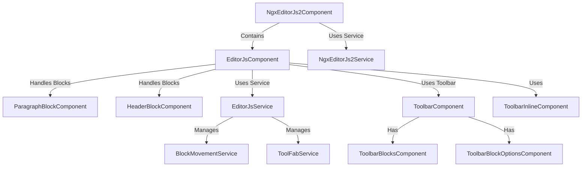

# Ngx-EditorJs2

DEMO: [https://ba5ik7.github.io/ngx-editorjs2](https://ba5ik7.github.io/ngx-editorjs2)

## Overview
Ngx-EditorJs2 is an Angular-based, highly extensible block-style editor inspired by Editor.js. It allows users to create and manage rich text content using a variety of customizable blocks while leveraging Angular's reactive capabilities.

### Supports
- Angular 19+
- For legacy Angular support, use [ngx-editorjs](https://github.com/Ba5ik7/ngx-editorjs)

## Features
- 📝 **Modular Block System** – Supports paragraph, header, and other content blocks.
- 🔄 **Reactive Data Streams** – Uses RxJS for efficient state management.
- 🎛 **Drag & Drop** – Easily reorder blocks with smooth animations.
- ✍ **Inline Toolbar** – Provides text formatting options when selecting text.
- 🔧 **Customizable** – Easily extendable with new block types and actions.

## Installation
To install Ngx-EditorJs2, run:

```sh
npm install @tmdjr/ngx-editor-js2
```

## Usage
Import the Component into your Angular Standalone Component:

```ts
import { NgxEditorJs2Component } from '@tmdjr/ngx-editor-js2';

@Component({
  selector: 'some-component',
  imports: [NgxEditorJs2Component],
  template: `
    <ngx-editor-js2
      [blocks]="initialBlocks"
      [requestBlocks]="requestBlocks"
      (blocksRequested)="handleBlocks($event)">
    </ngx-editor-js2>
  `,
})
```
- Implementation found in the [Demo Src](https://github.com/Ba5ik7/ngx-editorjs2/blob/main/projects/ngx-editorjs2-demo/src/app/components/document.component.ts#L9)

Css is required for the editor to function properly. Add the following to your global styles:

```css
// ! I Need to fix this!!
// The consumer should not have to incude this in their styles.scss
.cdk-drag-preview {
  color: var(--mat-sys-on-secondary-container);
  background-color: var(--mat-sys-secondary-container);
  border-radius: 8px;
  box-sizing: border-box;
  overflow: visible;
  box-shadow: var(--mat-sys-level4);

  & *:not(toolbar) {
    padding: 0 !important;
    margin: 0 !important;
  }
}

.cdk-drag-placeholder {
  opacity: 0;
}

.cdk-drag-animating {
  transition: transform 250ms cubic-bezier(0, 0, 0.2, 1);
}
```


## API
### **Inputs**
| Property      | Type                        | Description |
|--------------|----------------------------|-------------|
| `blocks`     | `NgxEditorJsBlock[]` \| `null`      | List of blocks to initialize the editor with. |
| `requestBlocks` | `any` | When the value changes `blocksRequested` will emit the current state of the blocks. |

### **Outputs**
| Property      | Type                        | Description |
|--------------|----------------------------|-------------|
| `blocksRequested` | `NgxEditorJsBlock[]` | Emits the current state of blocks in the Form Group. Trigger when the `requestBlocks` value changes

## Block Components
Ngx-EditorJs2 comes with built-in block components:
- **ParagraphBlockComponent** – Standard text block.
- **HeaderBlockComponent** – Allows different heading levels.

You can also add custom blocks by implementing the `NGX_EDITORJS_OPTIONS` provider:

```sh
npm install @tmdjr/ngx-editor-js2-image
```

```ts
import { NGX_EDITORJS_OPTIONS } from '@tmdjr/ngx-editor-js2';
import { NgxEditorJs2ImageComponent } from '@tmdjr/ngx-editor-js2-image';

export const appConfig: ApplicationConfig = {
  providers: [
    {
      provide: NGX_EDITORJS_OPTIONS,
      useValue: {
        consumerSupportedBlocks: [
          {
            // Customize the block name.
            name: 'Image',
            component: NgxEditorJs2ImageComponent,
            // Must match the component name.
            componentInstanceName: 'NgxEditorJs2ImageComponent',
          },
        ],
      },
    },
  ],
};
```

## Development
To contribute, clone the repository and install dependencies:

```sh
git clone git@github.com:Ba5ik7/ngx-editorjs2.git
cd ngx-editorjs2
npm i
```

Build the library:

```sh
npm run build-ngx-editor-js2
```

Build Customs Blocks:

```sh
npm run build-ngx-editor-js2-image
// etc...
```

Run the development server:

```sh
npm run start-demo
```

If you want to live reload the library, run the following commands in succession:

```sh
npm run watch-ngx-editor-js2 // Important to run 1st
npm run watch-ngx-editor-js2-image
// etc...

npm run start-demo
```

## Architecture Overview
Ngx-EditorJs2 is built on Angular's reactive architecture, using RxJS to manage state and data streams. The library is composed of several Services and Directives that handle different aspects of the editor:


## Services
| Service                   | Purpose |
|---------------------------|---------|
| `NgxEditorJs2Service`     | Manages available block types and loaded blocks. |
| `EditorJsService`         | Handles block rendering and form controls. |
| `BlockMovementService`    | Manages drag-and-drop & reordering. |
| `ToolbarInlineService`    | Manages inline text formatting. |
| `ToolFabService`          | Provides contextual toolbars for block actions. |

## Creating a Custom Block Component
Ngx-EditorJs2 follows a structured approach where each block component:
- **Implements the `BlockComponent` interface** to ensure consistency.
- **Uses `hostDirectives`** to inherit required behaviors such as drag-and-drop.
- **Uses `host` CSS classes** to apply styling and animations.
- **Uses a `formGroup`**, which integrates with the larger form structure that holds all blocks.

### **How Blocks Work in Ngx-EditorJs2**
Each block in Ngx-EditorJs2 is part of a larger **`formGroup`**, allowing seamless state management across the entire editor. This design ensures that:
- Each block maintains its own **FormControl**, enabling real-time data binding.
- The **editor-level formGroup** acts as a centralized store, making it easier to retrieve or modify block data.
- Blocks can **interact with services and directives**, enhancing their capabilities dynamically.

## License
MIT License © 2025 [Wesley DuSell](https://github.com/ba5ik7)

